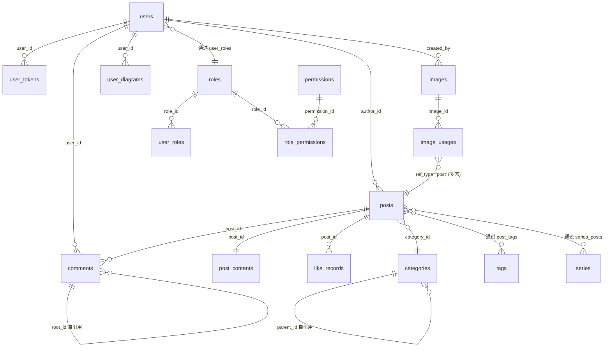

# LBlog 数据库 ER 图（AI 绘图用）

> 将以下结构描述输入 AI 绘图工具即可生成 ER 图。

---

## 指令

用 PlantUML 或 Mermaid 格式画 ER 图，主题色蓝灰系，显示表名、主键(PK)、外键(FK)和关键字段。

## 核心表关系

### 1. 用户与权限

```
users ──1:N──> user_tokens        (users.id ← user_tokens.user_id)
users ──M:N──> roles               (通过 user_roles 关联)
roles ──M:N──> permissions         (通过 role_permissions 关联)
```

### 2. 文章内容

```
users  ──1:N──> posts              (users.id ← posts.author_id)
posts  ──1:1──> post_contents      (posts.id ← post_contents.post_id)
posts  ──N:1──> categories         (categories.id ← posts.category_id)
posts  ──M:N──> tags               (通过 post_tags 关联)
posts  ──M:N──> series             (通过 series_posts 关联，含 sort_order)
posts  ──1:N──> comments           (posts.id ← comments.post_id, 树形: parent_id/root_id)
posts  ──1:N──> like_records       (posts.id ← like_records.post_id, 访客指纹)
```

### 3. 图片

```
users  ──1:N──> images             (users.id ← images.created_by)
images ──1:N──> image_usages       (images.id ← image_usages.image_id, 多态引用)
```

### 4. 站点与绘图

```
users  ──1:N──> user_diagrams      (users.id ← user_diagrams.user_id)
site_config  (单表 KV 配置)
```

## 字段摘要

### users
- PK: id
- UK: username, email

### posts
- PK: id
- UK: slug
- FK: author_id → users.id, category_id → categories.id
- 关键: title, status(0草稿1发布), view_count, like_count

### post_contents
- PK: id
- UK: post_id (1:1 with posts)
- 关键: body(longtext), format

### categories (树形)
- PK: id
- UK: slug
- FK: parent_id → categories.id (自引用)

### tags
- PK: id
- UK: slug

### series
- PK: id
- UK: slug
- 关键: is_completed, sort_order

### post_tags (M:N 关联表)
- PK: (post_id, tag_id)

### series_posts (M:N 关联表, 带排序)
- PK: (series_id, post_id)
- 关键: sort_order

### comments (树形)
- PK: id
- FK: post_id → posts.id, parent_id → comments.id, root_id → comments.id

### like_records
- PK: id
- UK: (post_id, visitor_id)  -- 匿名访客点赞, visitor_id 是浏览器指纹

### images
- PK: id
- 关键: url, storage_path, md5(去重), file_size

### image_usages
- PK: id
- UK: (image_id, ref_type, ref_id, field)
- 多态: ref_type='post', ref_id=文章ID, field='body'

### user_tokens
- PK: id
- UK: token_hash
- FK: user_id → users.id (唯一显式声明的外键)

### roles
- PK: id

### permissions
- PK: id

### user_roles
- UK: (user_id, role_id)

### role_permissions
- UK: (role_id, permission_id)

### site_config
- UK: config_key

### user_diagrams
- PK: id
- FK: user_id → users.id (隐式)

## Mermaid ER 图参考

如果 AI 绘图工具支持 Mermaid，可以使用以下语法：



## 约束说明

- 所有表使用软删除: `deleted_at` + `is_delelte=0`
- 外键均为逻辑外键（无 DDL 约束），仅 `user_tokens.user_id` 有声明式外键
- `post_contents` 使用 UK(post_id) 强制 1:1 关系
- `image_usages` 使用多态关联，ref_type + ref_id 指向任意表
