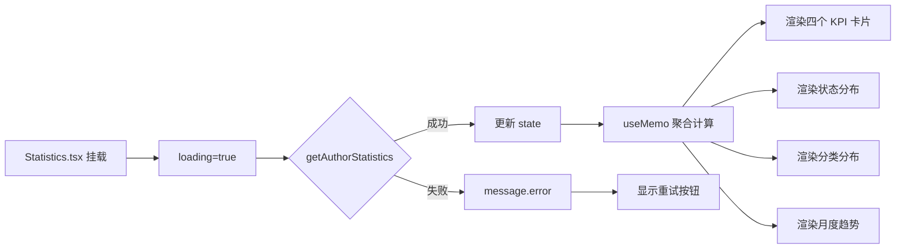

# 创作中心 · 个人数据统计设计文档

> 2026-05-08
> 关联后端仓库：lblog-server

---

## 1. 背景与目标

统计页面位于创作中心（`/author/statistics`），面向**已登录的作者/管理员**。

### 1.1 需求

创作中心所有操作都作用于**当前用户自己的内容**（文章 CRUD、分类/标签/专栏管理），统计数据同理，展示的是**作者个人的**文章相关数据，而非全站数据。

### 1.2 现有问题

当前 `Statistics.tsx` 使用硬编码静态数据：

```tsx
<Statistic title="文章总数" value={23} />
```

图表区域显示"待实现"，不具备任何实际功能。

---

## 2. 设计原则

### 2.1 聚合计算在后端

#### ❌ 反面方案：前端聚合

遍历 `getAdminPosts` 返回的所有文章列表，在前端做 `reduce` / `groupBy`：

- 作者文章较多时（数百篇以上），每次加载统计页都要传输大量文章数据
- 统计所需的数据只是几个数字，网络传输浪费严重
- `viewCount` / `likeCount` 等字段在文章列表接口中主要是展示用途，不应为了统计而大量传输
- 前端计算受限于接口分页，需要额外处理"全量拉取"逻辑

#### ✅ 正确方案：后端聚合

数据库层面执行 `SUM` / `COUNT` / `GROUP BY` 聚合：

- 网络传输量：几十字节，固定开销
- 查询性能：有 `author_id` 索引时，数百万行也是毫秒级
- 数据一致性：单次查询的事务快照，不跨请求
- 前端负担：一次请求，直接渲染

### 2.2 纯 CSS 图表，不引入第三方图表库

Ant Design 本身不提供图表组件，常见选择及对比：

| 方案 | 优点 | 缺点 |
|------|------|------|
| ECharts / AntV G2 | 功能丰富，交互好 | 包体积大（~500KB），仅统计页使用 |
| Recharts / Visx | React 友好 | 仍会增加依赖和体积 |
| 纯 CSS 柱状图 | 零依赖，够用 | 交互有限 |

统计页只需要水平柱状图和垂直柱状图，纯 CSS 完全胜任，引入图表库不值当。

---

## 3. 接口设计

### 3.1 新增 API

```
GET /api/v1/author/statistics
```

#### 请求

无参数。通过 JWT Token 中的用户信息确定作者身份。

#### 认证要求

- `Authorization: Bearer <accessToken>`
- 普通 `user` 角色无权限访问（返回 403）
- `author` / `admin` 可访问

#### 响应结构

```json
{
  "code": 0,
  "message": "success",
  "data": {
    "totalPosts": 12,
    "totalViews": 3456,
    "totalLikes": 234,
    "totalComments": 89,
    "statusDistribution": [
      { "status": 0, "count": 3 },
      { "status": 1, "count": 8 },
      { "status": 2, "count": 1 }
    ],
    "categoryDistribution": [
      { "categoryName": "JavaScript", "categorySlug": "javascript", "postCount": 5 },
      { "categoryName": "Python",     "categorySlug": "python",     "postCount": 3 },
      { "categoryName": "DevOps",     "categorySlug": "devops",     "postCount": 2 }
    ],
    "monthlyTrend": [
      { "month": "2025-06", "count": 2 },
      { "month": "2025-07", "count": 0 },
      { "month": "2025-08", "count": 5 },
      { "month": "2025-09", "count": 3 },
      { "month": "2025-10", "count": 0 },
      { "month": "2025-11", "count": 1 },
      { "month": "2025-12", "count": 0 },
      { "month": "2026-01", "count": 4 },
      { "month": "2026-02", "count": 0 },
      { "month": "2026-03", "count": 6 },
      { "month": "2026-04", "count": 2 },
      { "month": "2026-05", "count": 1 }
    ]
  }
}
```

#### 字段说明

| 字段 | 类型 | 说明 |
|------|------|------|
| totalPosts | number | 文章总数（全部状态） |
| totalViews | number | 所有文章 viewCount 之和 |
| totalLikes | number | 所有文章 likeCount 之和 |
| totalComments | number | 所有文章 commentCount 之和 |
| statusDistribution | array | 按 status 分组的文章数，status: 0=草稿 1=已发布 2=私密 |
| categoryDistribution | array | 按分类分组的文章数，按 postCount 降序排列 |
| monthlyTrend | array | 近 12 个月每月发文数（含 0 的月份），按 month 升序 |

#### monthlyTrend 的特殊说明

- 返回**最近 12 个自然月**的数据，不足 12 个月时从第一篇发文算起
- 没有文章的月份也需要返回 `{ "month": "2026-02", "count": 0 }`，保持数组长度为 12
- 这样做是为了前端画柱状图时横轴对齐，空缺月份也能看出节奏

### 3.2 后端实现参考（SQL）

```sql
-- 1. 汇总指标
SELECT
  COUNT(*)             AS totalPosts,
  COALESCE(SUM(viewCount), 0)    AS totalViews,
  COALESCE(SUM(likeCount), 0)    AS totalLikes,
  COALESCE(SUM(commentCount), 0) AS totalComments
FROM posts
WHERE author_id = ?;

-- 2. 按状态分组
SELECT status, COUNT(*) AS count
FROM posts
WHERE author_id = ?
GROUP BY status;

-- 3. 按分类分组（NULL = 未分类）
SELECT
  COALESCE(c.name, '未分类')   AS categoryName,
  COALESCE(c.slug, '')        AS categorySlug,
  COUNT(p.id)                  AS postCount
FROM posts p
LEFT JOIN categories c ON c.id = p.category_id
WHERE p.author_id = ?
GROUP BY p.category_id
ORDER BY postCount DESC;

-- 4. 按月聚合（近12个月）
SELECT
  DATE_FORMAT(p.created_at, '%Y-%m') AS month,
  COUNT(*) AS count
FROM posts p
WHERE p.author_id = ?
  AND p.created_at >= DATE_SUB(NOW(), INTERVAL 12 MONTH)
GROUP BY month
ORDER BY month;
```

性能说明：
- 四条 SQL 总执行时间通常在 10ms 以内（有 `author_id` 索引）
- `posts` 表需要 `author_id` 索引，`created_at` 可以是个复合索引 `(author_id, created_at)`
- 在 Java 端用 `@Transactional` 保证四条查询在同一事务内执行，避免并发带来的不一致性

### 3.3 异常处理

| 场景 | HTTP 状态码 | code | message |
|------|------------|------|---------|
| 未登录 | 401 | 401 | 未登录 |
| 角色不足 | 403 | 403 | 无权限 |
| 正常（无文章） | 200 | 0 | success（所有指标为 0 / 空数组） |

---

## 4. 前端数据流



### 4.1 前端新增 API 函数

```typescript
// api.ts

export interface AuthorStatistics {
  totalPosts: number;
  totalViews: number;
  totalLikes: number;
  totalComments: number;
  statusDistribution: Array<{ status: number; count: number }>;
  categoryDistribution: Array<{ categoryName: string; categorySlug: string; postCount: number }>;
  monthlyTrend: Array<{ month: string; count: number }>;
}

export async function getAuthorStatistics(): Promise<ApiResponse<AuthorStatistics>> {
  return request<AuthorStatistics>('/api/v1/author/statistics');
}
```

### 4.2 状态与异常处理

| 状态 | 表现 |
|------|------|
| Loading | 全局 Spin 覆盖内容区 |
| 错误 | message.error 弹出，显示"重新加载"按钮 |
| 空数据（totalPosts = 0） | 顶部提示"还没有发表过文章"，卡片仍可渲染（全 0） |
| 正常 | 渲染所有图表 |

### 4.3 图表实现方案

全部使用纯 CSS div 柱状图：

**状态分布 / 分类分布（水平柱状图）：**

```tsx
<div style={{ display: 'flex', alignItems: 'center', marginBottom: 8 }}>
  <span style={{ width: 80 }}>{name}</span>
  <div style={{
    width: `${(count / maxCount) * 100}%`,
    height: 24,
    background: color,
    borderRadius: 4,
    display: 'flex',
    alignItems: 'center',
    paddingLeft: 8,
    color: '#fff',
    fontSize: 13,
    minWidth: count > 0 ? 30 : 0,
  }}>
    {count > 0 ? count : ''}
  </div>
</div>
```

**月度趋势（垂直柱状图）：**

```tsx
<div style={{ display: 'flex', alignItems: 'flex-end', gap: 4, height: 200 }}>
  {months.map(m => (
    <div key={m.month} style={{ flex: 1, display: 'flex', flexDirection: 'column', alignItems: 'center' }}>
      <div style={{ fontSize: 12, marginBottom: 4 }}>{m.count > 0 ? m.count : ''}</div>
      <div style={{
        width: '70%',
        height: `${(m.count / maxCount) * 180}px`,
        background: '#1e80ff',
        borderRadius: '4px 4px 0 0',
        minHeight: m.count > 0 ? 4 : 0,
      }} />
      <div style={{ fontSize: 11, marginTop: 4, color: '#999' }}>
        {m.month.slice(5)}月
      </div>
    </div>
  ))}
</div>
```

---

## 5. 布局

```
┌─────────────────────────────────────────────────────┐
│  创作中心 · 站点统计                                  │
│                                                     │
│  ┌──────┐  ┌──────┐  ┌──────┐  ┌──────┐            │
│  │文章  │  │浏览  │  │点赞  │  │评论  │            │
│  │总数  │  │总量  │  │总量  │  │总量  │            │
│  │  12  │  │3,456 │  │ 234  │  │  89  │            │
│  └──────┘  └──────┘  └──────┘  └──────┘            │
│                                                     │
│  ┌──────────────┐  ┌──────────────┐                 │
│  │ 文章状态分布   │  │ 分类分布      │                 │
│  │              │  │              │                 │
│  │ 已发布 ███ 8  │  │ JS ██████ 5  │                 │
│  │ 草稿   ███ 3  │  │ Python ██ 3 │                 │
│  │ 私密   █  1   │  │ DevOps █  2 │                 │
│  └──────────────┘  └──────────────┘                 │
│                                                     │
│  ┌──────────────────────────────────────┐            │
│  │ 每月发文趋势                          │            │
│  │                                      │            │
│  │    █                                  │            │
│  │    █     █                            │            │
│  │  █ █  █  █  █     █  █              │            │
│  │  6  7  8  9 10 11 12  1  2  3  4  5  │            │
│  └──────────────────────────────────────┘            │
└─────────────────────────────────────────────────────┘
```

---

## 6. 后续扩展可能

当前设计预留了扩展空间，未来可增补但无需修改接口结构：

- **折线图代替柱状图**（前端渲染方式变化，数据不变）
- **新增指标**如平均浏览/平均点赞（后端加字段，前端加卡片）
- **时间范围选择**：月度趋势支持按年/按季度聚合（新增参数，数据结构可复用）
- **下载统计报表**（数据已有，前端加导出按钮）
